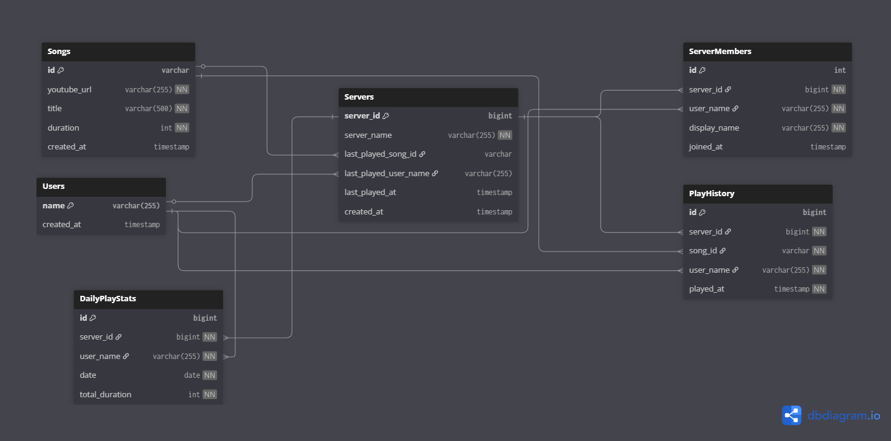
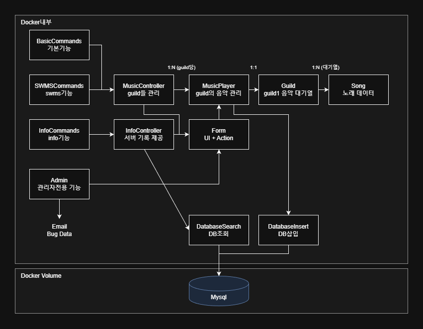

# wasureta
discord music bot develop start 2024.11.01
develop by nacl12(discord name)

기본적으로 음악 봇이며, 대규모 음악 봇에서 원하는 기능이 없던 것을 추가하기 위해 직접 제작했습니다.
/명령어 와 !명령어 를 모두 지원하지만, /명령어 사용을 권장합니다. (슬래시 명령어에는 필수 인자가 명시되어 혼동을 줄입니다.)

## 프로젝트 구조

### 데이터베이스 스키마


**테이블 구조 설명:**
- `Songs`: 유튜브 영상의 기본 정보 저장 (ID, URL, 제목, 재생시간)
- `Users`: 디스코드 사용자의 고유 식별자 저장
- `Servers`: 디스코드 서버 정보와 마지막 재생 곡 추적
- `ServerMembers`: 서버별 사용자 정보 (서버마다 다른 닉네임 저장)
- `PlayHistory`: 모든 재생 기록 저장
- `DailyPlayStats`: 일별 청취 시간 집계

### 클래스 다이어그램


**아키텍처 설명:**

**Docker 내부:**
- `Cog Commands`: Discord.py의 Cog 구조로 명령어 그룹화
  - BasicCommands: 음악 재생 기본 기능
  - SWMSCommands: 시그니처 기능
  - InfoCommands: 통계 조회 기능
  - Admin: 개발자 전용 기능

- `MusicController`: 모든 서버(Guild)의 음악 재생 관리
  - 1:N 관계로 여러 서버 동시 처리
  - 각 서버마다 MusicPlayer 인스턴스 생성

- `MusicPlayer`: 개별 서버의 음악 재생 담당
  - 1:1 관계로 하나의 Guild 관리
  - 대기열, 반복 설정 등 서버별 상태 유지

- `Guild`: 서버의 음악 대기열과 현재 재생 정보
  - Song 객체들을 deque로 관리
  - 재생 중인 곡, 마지막 재생 곡 추적

- `DatabaseInsert/Search`: MySQL 데이터베이스 연동
  - 재생 기록 저장
  - 통계 조회

- `Form`: Discord UI 생성 (Embed, Button, View)
  - 검색 결과, 대기열 표시
  - 버튼을 통한 인터랙션 처리

- `ErrorController`: 오류 수집 및 이메일 리포트
  - 매일 자정 오류 내역을 개발자 이메일로 전송
  - Error.txt 파일에 로그 기록

- `StateChecker`: 명령어 실행 전 상태 검증
  - 음성 채널 연결 확인
  - 권한 검증

- `VoiceChannelObserver`: 음성 채널 활동 추적
  - 사용자 청취 시간 측정
  - DailyPlayStats 업데이트

## Get Started
### 환경 변수
- `.env` 파일 생성
```
  TOKEN=디스코드 봇 토큰
  MYSQL_PASSWORD=mysql 비밀번호
  EMAIL=오류보고용 이메일주소
  EMAIL_PASSWORD=이메일 앱 비밀번호
```
- Error.txt 파일 생성

### for local (권장)
**필수설치** python 3.11+, FFmpeg, MySQL 8.0+
```
git clone https://github.com/SodiumD5/discord_bot_wasureta.git
pip install -r requirements.txt
python wasu.py
```

### for docker
docker외부에 volume으로 mysql설정 필요함.
```
docker pull sodiumd/wasureta:latest
docker run -d \
  --name wasureta \
  --restart unless-stopped \
  -e TOKEN=디스코드 봇 토큰 \
  -e MYSQL_HOST=host.docker.internal \
  -e MYSQL_PASSWORD=mysql 비밀번호 \
  -e EMAIL=오류보고용 이메일주소 \
  -e EMAIL_PASSWORD=이메일 앱 비밀번호 \
  sodiumd/wasureta:latest
```
docker 컨테이너로 실행 시, discord와의 연결 불안정

## 

<details>
  <summary>wasureta 명령어 설명서</summary>

  ## 🎵 기본 명령어
  ### **`/play`**
  유튜브 링크(플리도 가능), 검색어를 통해서 노래를 추가한다.
  ### **`/skip`**
  현재 재생 중인 음악을 스킵한다.
  ### **`/pause`**
  재생을 일시정지/재시작한다.
  ### **`/leave`**
  봇을 내보낸다.
  ### **`/refresh-que`**
  대기열의 모든 음악을 삭제한다.
  ### **`/que`**
  현재 재생 중인 노래와 대기열의 상태를 보여주고, 음악을 삭제할 수 있다.
  ### **`/repeat`**
  반복 재생 모드를 전환할 수 있다.
  ### **`/jump`** `HH:MM:SS`
  재생 중인 곡의 특정 시간으로 이동합니다.
  (예: `/jump 12:34`→ 12분 34초로 이동)

  ## 📊 통계 명령어
  ### **`/last-played`**
  서버에서 가장 마지막으로 들었던 노래의 정보를 제공한다.
  ### **`/ranking` `(신청곡 수 순위) / (청취 시간 순위)`**
  서버에서 멤버들의 신청곡 수 또는 청취 시간 순위를 제공한다.
  ### **`/search-top10` `멤버이름(기본값:서버전체)`**
  한 멤버(미입력시:서버전체)가 많이 재생된 노래의 순위를 제공한다.
  (단, 멤버이름은 서버별 이름이다.)
  ### **`/playlist` `멤버이름(기본값:서버전체)` `검색 마지막 순위(기본값:100)`**
  서버에서 재생된 노래를 바탕으로 멤버 출퇴(아티스트)를 만들어줍니다.
  (단, 멤버이름은 서비블 이름입니다.)

  ## 📝 시그니처 명령어
  ### **`/wasu` `(원곡) / (신원미상 반응)`**
  wasureta원곡 또는 리엑션을 들을 수 있다.
  ### **`/swms`**
  신원미상의 유튜브 영상 중 랜덤영상을 들려준다.

  ## ➕ 부가 명령어
  ### **`/---`**
  선을 긋는다.
  ### **`/ping`**
  ping을 보낸다.
</details>

<details>
<summary>wasureta version update</summary>

  ### release 1.0 beta
  - /play, /que, /now-playing, /skip, /pause, /leave, /refresh-que, /repeat, /wasu, /swms, /search-server-top10, /search-user-top10, /how-many-played, /playlist 명령어 추가
  - db : local mysql

  ### release 1.1 update 
  - /last-played, /jump 명령어 추가
  - /now-playing 기능 /que로 통합
  - db : supabase (유지보수를 위해)
  - dockerfile 도입

  ### release 1.2 refatoring
  - OOP로 refactoring
  - top10 명령어 통합, /how-many-played 삭제
  - 전반적인 db구조 변경
  - 개발자 email로 오류 메세지 전송
  - 개발자 전용 공지 기능 추가 (/notice)
  - db : mysql (with.docker volume)

</detauls>
